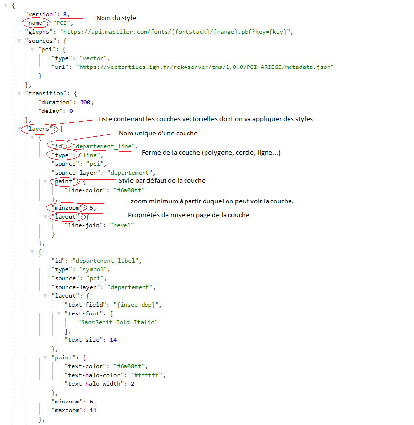
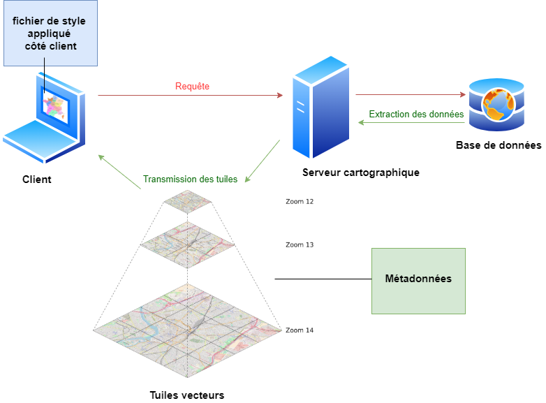
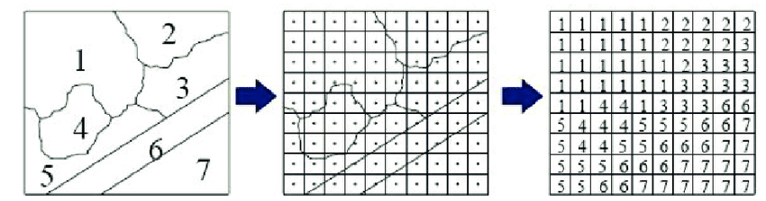
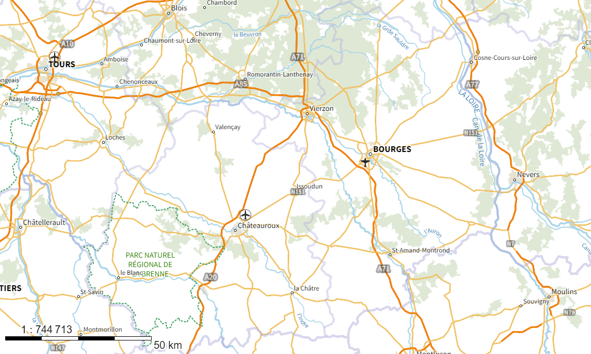
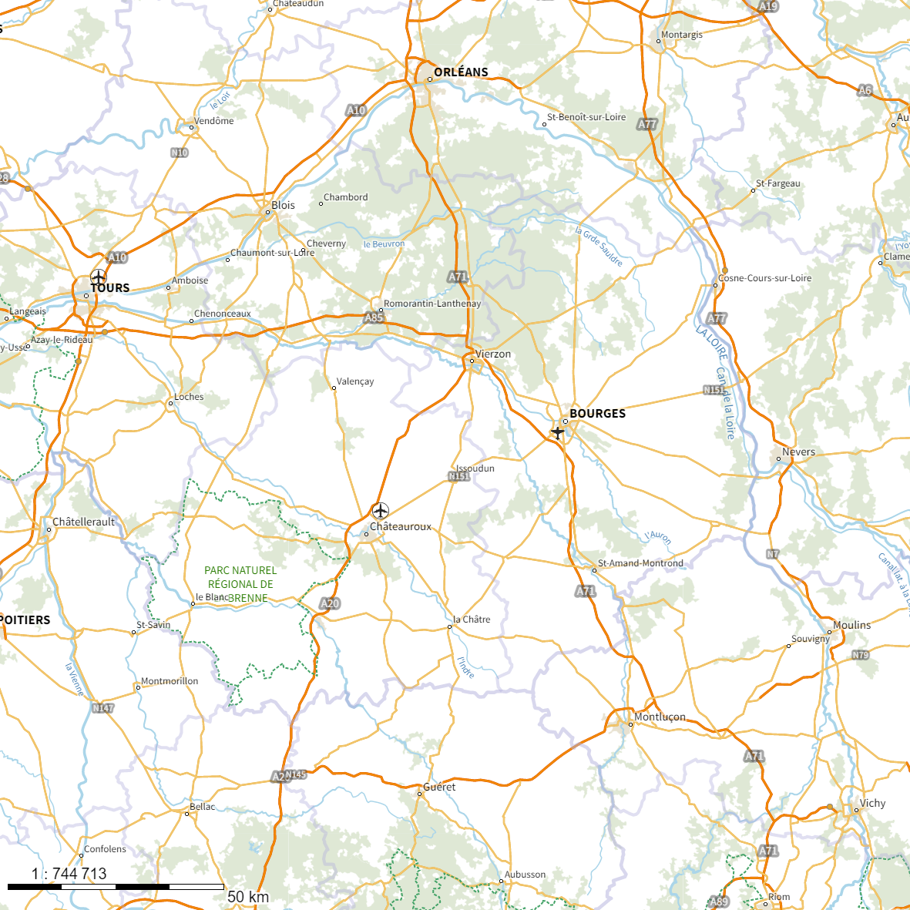
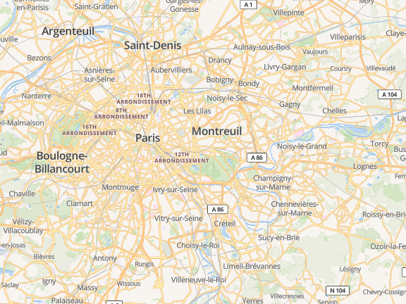
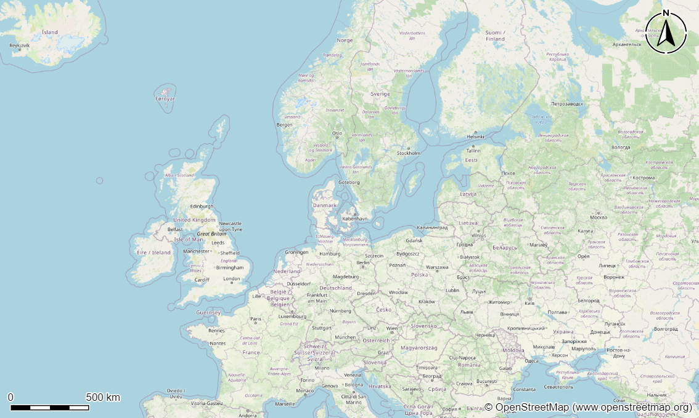

# **ORVT : Outil de rasterisation pour les vecteurs tuilés**

## **Table des matières**
- **[I - Introduction](#i---introduction)**
- **[I.1 - Système d'information géographique](#i1---système-dinformation-géographique)**
    -  **[1.1.1 - Acquisition des données géographiques](#i11---acquisition-des-données-géographiques)**
- **[I.2 - Données géographiques : vecteur et raster](#i2---données-géographiques--vecteur-et-raster)**
    - **[I.2.1 - Mode vecteur](#i21---mode-vecteur)**
        - **[I.2.1.1 - Généralités](#i211---généralités)**
        - **[I.2.1.2 - Table attribuaire](#i212---table-attribuaire)**
    - **[2.2 - Mode raster](#i22---mode-raster)**
        - **[I.2.2.1 - Généralités](#i221---généralités)**
    - **[I.2.3 - Le principe de couches](#i23---le-principe-de-couches)**
- **[I.3 - Tuiles](#i3---tuiles)**
- **[I.4 - Web Mapping](#i4---web-mapping)**
    - **[I.4.1 Architecture de la cartographie web](#i41---architecture-de-la-cartographie-web)**
- **[I.5. Tuiles vectorielles : symbologie](#i5---tuiles-vectorielles--symbologie)**
- **[I.6. Rasterisation](#i6---rasterisation)**
- **[II - Etat de l'art des solutions techniques permettant d'effectuer une rasterisation de flux de vecteurs tuilés à l'IGN](#ii---etat-de-lart-des-solutions-techniques-permettant-deffectuer-une-rasterisation-de-flux-de-vecteurs-tuilés-à-lign)**
**[II.1 - Objectif](#ii1---objectif)**

## **Glossaire**
**OGC :** Open Géospatial Consortium

**JSON :** Javascript Object Notation est un format d'échange léger de données

**SIG :** Système d'information géographique

**MapBox :** entreprise américaine spécialisée dans la cartographie en ligne

**API :** Application Programming Interface

**Javascript :** Langage de programmation principalement utilisé dans le cadre du développement de pages web intéractives.

**OpenLayers :** Librairie javascript permettant de créer des cartes géographiques web

**Librairie informatique :** c'est un ensemble de classes et de fonctions déjà pré-codées par des développeurs et  accessible publiquement généralement dans une dépôt, utilisable dans le développement des applications selon le besoin.

**PDF :** Portable Document Format est un format de document très utilisée sur différents appareils informatiques(tablettes, ordinateurs, téléphones portables)

**NPM :** Node Package Manager est un gestionnaire de librairies javascript

# **I - Introduction**

## **I.1 - Système d'information géographique**
Un système d'information géographique est un système d'information composé de matériels, d'outils informatiques, de logiciels et de personnel qualifié, spécialement conçu pour recueillir, stocker, analyser, traiter, gérer et diffuser les données géographiques. On appelle donnée géographique une donnée contenant une référence à un lieu ou une position des entités à la surface de la terre. Elles sont utilisées dans plusieurs domaines notamment de la cadre de la recherche scientifique, dans le domaine des transport, de l'agriculture etc...

### **I.1.1 - Acquisition des données géographiques**
Les données géographiques sont obtenues de plusieurs façons. Les deux manières les plus utilisées sont l'imagerie aérienne et l'imagerie satellitaire.
- **Imagerie aérienne** : Une photographie aérienne désigne une photographie prise depuis les airs. L'IGN avec sa flotte aérienne (4 avions), photographie l'ensemble du territoire avec des caméras numériques tous les 3 ans. Les avions se placent à une certaine altitude et s'y tiennent en prennant des images numériques verticales couvrant 1.5 km de longeur par 1.5 km de largeur au sol. Ces opérations se font itérativement afin de couvrir l'ensemble du térritoire national.
- **Imagerie satellitaire** : Une image satellite désigne une prise de vue transmise par un satellite en orbite. Grâce à un personnel compétent en géométrie et en photogrammétrie, l'IGN a réussi à développer des chaînes de production opérationnel de cartographie à parties d'images satellites.

## **I.2 - Données géographiques : vecteur et raster**
Il existe deux manières de représenter les données géographiques de manière numérique à savoir : le mode vecteur et le mode raster.

### **I.2.1 - Mode vecteur**
#### **I.2.1.1 - Généralités**
Les données géographiques en mode vecteur permettent de modéliser le monde réel à travers des objets. Un objet est caractérisé par deux éléments : les informations qui lui sont associées ou données attributaires et sa forme ou sa géométrie. La géométrie est constituée d’un ou plusieurs points interconnectés. Un point est une position dans l’espace. Il existe trois principaux types de géométrie : point, ligne et polygone. Si un objet dispose d’un seul point, alors sa forme est un point. Si un objet dispose de plusieurs points qui ne forment pas de forme géométrique fermée, alors sa forme est une ligne. Si un objet dispose de plusieurs points interconnectés formant une forme géométrique close, alors sa forme est un polygone.

#### **I.2.1.2 - Table attribuaire**
Les objets peuvent être par exemple des maisons, des routes ou arbres. Ils sont stockés 
dans des bases de données avec leurs coordonnées spatiales et leurs données attributaires ou métadonnées. Les données ou tables attributaires permettent de décrire les propriétés de l'entité. Les objets sont regroupés par thème dans les tables. Par exemple on regroupe toutes les entités représentant des batiments dans une même table. Une table est composé de lignes et de colonnes. Chaque colonne représente une caractéristique de l'entité comme la surface, la hauteur ou la date de construction d'un bâtiment. Chaque ligne représente une entité.

### **I.2.2 - Mode raster**
#### **I.2.2.1 - Généralités**
Les données géographiques en mode raster sont des images constitués de plusieurs pixels organisés sous forme de grilles en lignes et colonnes. Un pixel est l'unité de base de la définition d'une image numérique matricielle. A chaque pixel est associé une ou plusieurs valeurs numériques décrivant les caractéristiques de l'espace telles que la température, l'altitude ou la végétation. 

### **I.2.3 - Le principe de couches**
Si l’on souhaite représenter différents types d’objets on utilise le principe de superposition 
de couches qui consiste à disposer différentes couches d’objets les unes sur les autres afin de constituer une carte. Chaque couche regroupes les données appartenant à une même thématique ou classe d'objets (immeubles, routes etc...)

## **I.3 - Tuiles**
Les tuiles (rasters ou vecteurs) sont des paquets de données géographiques prédécoupées en forme de dalles par le serveur, prêtes à être transférées lorsqu’une requête est émise. Elles peuvent avoir différentes tailles : 64x64, 256x256, 512x512 pixels. Les services web utilisent le plus souvent des tailles de 256x256. Ces tuiles sont produites par le serveur en fonction de l’échelle de visualisation. On appelle cela le principe de la pyramide. À chaque niveau de zoom, des tuiles spécifiques sont fournis. Les tuiles présentent plusieurs avantages d'utilisation dont :
- La rapidité d'acès à la donnée lors d'une requête car les tuiles sont prédécoupées à l'avance par le serveur ou fabriqué à la volée et stocker dans le cache
- La possibilité de personnalisation du style côté client (pour les tuiles vectorielles)

## **I.4 - Web Mapping**
Une carte géographique est une représentation graphique d'un espace géographique. Avec l'évolution des technologies et d'internet, le besoin d'affichage de cartes géographiques sur tous types d'écrans devient de plus en plus demandé par les utilisateurs et cela est possible grâce au Web mapping. Le web mapping ou cartographie web est la forme de cartographie qui fait usage d’internet afin de concevoir, traiter, produire et publier des cartes géographiques. Ces communications sont possibles grâce à un ensemble de règles appelées protocole. L’OGC est une organisation internationale qui implémente des standards pour les services et le contenu géospatial, le traitement de données géographiques et les formats d’échange.
Parmi les spécifications, les plus couramment utilisés à l'IGN sont :

- **Web Feature Service (WFS)** : Permet au moyen d’une URL formatée, d’interroger des 
serveurs cartographiques afin de manipuler des objets géographiques vectoriels. Les opérations de manipulations permettent de : créer de nouveaux objets, effacer, récupérer, rechercher ou mettre à jour des objets. Le protocole WFS permet d'effectuer 5 principales requêtes afin d'obtenir des informations :
    - GetCapabilities : permet de connaître les capacités du serveur (quelles opérations sont supportées et quels objets sont fournis).
    - DescribeFeatureType : permet de retourner la structure de chaque entité susceptible d’être fournie par le serveur.
    - GetFeature : permet de livrer des objets (géométrie et/ou attributs) en GML (Geography Markup Language).
    - LockFeature : permet de bloquer des objets lors d'une transaction.
    - Transaction : permet de modifier l'objet (création, mise à jour, effacer).

    On retrouve plusieurs paramètres selon les requêtes :
    - paramètres communs :
        - VERSION : la version du service utilisée (1.0.0, 2.0.0, …)
        - REQUEST : la requête adressée au serveur (GetCapabilities, GetFeature ou DescribreFeatureType)
        - SERVICE : le type de service (ici "WFS")
    - paramètres requête DescribeFeatureType :
        - TYPENAME : le nom du type d’élément (classe d’objet) dont on veut connaitre la structure
    - paramètres requête GetFeature :
        - TYPENAME : le nom du type d’élément (classe d’objet) dont on veut récupérer des éléments (objets)
        - OUTPUTFORMAT : le format de réponse à la requête
        - COUNT : le nombre maximum d’éléments retournés (MAXFEATURES si version 1.0.0, COUNT si version 2.0.0)
        - FILTER : le filtre personnalisé qui va permettre d’effectuer des sélection sur les éléments à récupérer.

    La structure d'une URL WFS est la suivante : http://host/path?name=value& où name=value& correspond à une liste de paramètres

-  **Web Map Service (WMS)** : Permet de mettre à disposition d’utilisateurs distants des images géoréférencées, via une simple requête HTTP, à partir de données sources raster (image) ou vecteur. Le protocole WMS permet d'effectuer 3 principales requêtes :
    - GetCapabilities : retourne les méta-données qui décrivent le contenu du service et les paramètres acceptés
    - GetMap : renvoie une image de la carte ;
    - GetFeatureInfo : renvoie des informations sur les objets ayant servi à générer la carte (optionnelle).

    On retrouve plusieurs paramètres selon les requêtes :
    - paramètres communs :
        - VERSION : la version du service utilisée (1.0.0, 2.0.0, …)
        - REQUEST : la requête adressée au serveur (GetCapabilities, GetFeature ou DescribreFeatureType)
        - SERVICE : le type de service (ici "WMS")
    - paramètres requête GetFeature :
        - FORMAT : le format de sortie - type-mime - du fichier image (“image/png”, “image/jpg”, …) 
        - LAYERS : la ou les ressources à utiliser pour calculer l’image. C’est le nom technique de la ressource qui est utilisé ;
        - STYLES : le style de rendu des couches ;
        - WIDTH : largeur de l’image finale en pixels ;
        - HEIGHT : hauteur de l’image finale en pixels ;
        - En WMS 1.0 WMS 1.1 et WMS 1.2, le paramètre SRS (Spatial Reference Système) et en WMS 1.3 le paramètre est renommé CRS. Ce paramètre indique le système de coordonnées utilisé ;
        - BBOX (Bounding Box) : l’emprise géographique des données à rendre dans l’image.
        - DPI : densité de l’image attendue en “dot per inch” ou “pixel par pouce” (par défaut : 90,7 DPI).
        - OUTPUTFORMAT correspond au format de sortie de l'image (exemple : image/png).

        La structure d'une URL WMS est la suivante : http://host/path?{name=value&} où name=value& correspond à une liste de paramètres

- **Web Map Tile Service (WMTS)** : Permet d'obtenir des cartes géo-référencées tuilées à partir d'un serveur. Ce service est comparable au Web Map Service (WMS) mais tandis que le WMS permet de faire des requêtes nécessitant une certaine puissance de calcul côté serveur à chaque requête, le WMTS met l'accent sur la performance et ne permet de requêter que des images pré-calculées (tuiles) par le serveur. Le protocole WMTS permet d'effectuer 3 principales requêtes :
    - GetCapabilities : retourne les méta-données qui décrivent le contenu du service et les paramètres acceptés
    - GetTile : renvoie une image précalculée de la pyramide
    - GetFeatureInfo : renvoie des informations additionnelles sur un endroit d’une image retournée (optionnelle)

     On retrouve plusieurs paramètres selon les requêtes :
    - paramètres communs :
        - VERSION : la version du service utilisée
        - REQUEST : la requête adressée au serveur
        - SERVICE : le type de service (ici "WMTS")
    - paramètres requête GetFeature :
        - FORMAT : le format de sortie du fichier image 
        - LAYERS : le nom de la couche concernée
        - TILEMATRIXSET : Le nom de la pyramide d’images
        - TILEMATRIX : Le nom de la matrice qui contient la tuile
        - TILEROW : Le numéro de ligne du coin supérieur gauche de la tuile
        - TILECOL : Le numéro de colonne du coin supérieur gauche de la tuile

    La structure d'une URL WMTS est la suivante : http://host/path?{name=value&} où name=value& correspond à une liste de paramètres. 

- **Tile Map Service (TMS)** : Le service TMS est comme le service WFS. Il Transmet des données géographiques vectorielles mais sous formes de tuiles vecteurs. Le protocole TMS permet d'effectuer 2 principales opérations :
    - Accès aux capacités du service : renvoie les ressources disponibles, les styles prédéfinis
    - Accès à une tuile : renvoie une tuile vectorielle pré-calculée

### **I.4.1 - Architecture de la cartographie web**
La cartographie web se base sur une architecture client/serveur:
- Client : Ici généralement représenté par un navigateur web, permet de visualiser les données géographiques transmises depuis le serveur
- Serveur : Traite les données géographiques et les transmet

Selon l'utilisation du service tuilage ou non, le processus de production de données géographiques du côté serveur se fait différemment

- Architecture sans utilisation du service de tuilage : La communication s’effectue de la
manière suivante (voir figure 7) :
    - Le client envoie une requête pour l’affichage d’une carte web géographique
    - Le serveur reçoit la requête
    - Le serveur extrait les données nécessaires à la constitution de la carte web géographique à partir de la base de données
    - Le serveur transmets les données géographiques
    - La carte géographique web est constituée à partir des données géographiques reçues du serveur

- Architecture avec utilisation du service de tuilage : La communication s’effectue de la
manière suivante (voir figure 7) :
    - Le client envoie une requête pour l’affichage d’une carte web géographique
    - Le serveur reçoit la requête
    - Le serveur extrait les données nécessaires à la constitution de la carte web 
    géographique à partir de la base de données
    - Le serveur sélectionne les tuiles si elles avaient déjà été chargée ou sinon les 
    fabrique à la volée par rapport à l’échelle de visualisation et la zone concernée et les 
    transmet au client
    - Le serveur transmets les données géographiques permettant de fabriquer la carte web côté client
    - La carte géographique web est constituée à partir des tuiles vecteurs reçues du 
    serveur

## **I.5 - Tuiles vectorielles : symbologie**
Comme dans notre étude nous nous intéréssons principalement aux tuiles vectorielles, il est plus que nécessaire de parler de symbologie. La symbolologie est l'ensemble d'éléments (palette de couleurs, polices d'écriture, icônes...), utilisé afin de donner une apparence visuelle à la carte et ainsi mettre en valeur les informations en fonction de leur importance. L'un des avantages comme on le disait plus haut des tuiles vectorielles est qu'elles offrent la possibilité à un utilisateur de créer sa propre symbologie côté client à travers la création d'un fichier de style. Le fichier de style va permettre de représenter chaque entité comme le souhaite l'utilisateur à travers des règles de styles bien définis. Plusieurs normes permettent de créer une symbologie côté client à savoir :
- [MapBox GL JS](https://docs.mapbox.com/mapbox-gl-js/style-spec/) : document de style au format JSON créé par MapBox.
- [Carto CSS](https://cartocss.readthedocs.io/en/latest/) : syntaxe similaire au CSS, permettant de créer un style pour des données géographiques.

**Le fichier de style** est appliqué côté client comme montré dans la figure ci-dessous :

## **I.6 - Rasterisation**
De manière globale, la rasterisation est un procédé qui consiste à convertir une image vectorielle en une image matricielle destinée à être affichée sur un écran ou imprimée par un matériel d'impression. Dans le cadre des SIG, la rastérisation est le passage du mode vecteur au mode raster : c'est la conversion de vecteurs (point, polygone, ligne) en une grille matricielle de pixels où chaque pixel comprend une valeur. Une chose devient donc essentielle lors de la rasterisation, c'est la résolution de l'image obtenue. La résolution de l'image fait en sorte d'obtenir une image nettement clair en ayant le plus de pixel. Plus il y aura de pixel plus les informations sur la carte seront facilement distinguable.

&nbsp;
# **II - Etat de l'art des solutions techniques permettant d'effectuer une rasterisation de flux de vecteurs tuilés à l'IGN**
## **II.1 - Objectif**
Avec l'utilisation de plus en plus fréquente des cartes sur le web et sur des applications mobiles, le besoin parfois d'obtenir une image de cette carte ou de l'imprimer peut vraiment être problématique du fait de la qualité de rendu de l'image qui peut être parfois très floue. Actuellement il n'existe pas de solutions techniques à l'IGN permettant de répondre à ce besoin. L'objectif pour nous donc sera d'effectuer des propositions de différentes solutions techniques permettant de faire une rasterisation de flux de vecteurs tuilés à travers cet état de l'art.

## **II.2 - Solutions techniques**
### **II.2.1 - Librairie Javascript : ol-map-screenshot**
ol-map-screenshot est une librairie javascript disponible sur npm, que l'on peut utiliser pour obtenir une image (capture d'écran) d'une carte web au format PNG, JPEG. Vous trouverez une demo de l'utilisation la librairie [ici](https://jmmluna.github.io/ol-map-screenshot/demo/)

- **Caractéristique de la librairie :**
    - Image de la carte customisables à travers des options
    - Prise en charge des formats JPEG, PNG
    - Métadonnées de capture d'écran dans le résultat
    - Rendu de la barre d'échelle

- **Options de rendu de l'image :**
    - dimension : Taille de l'image souhaitée en milimètres (longueur et largeur)
    - L'échelle de la carte
    - Longueur de la barre d'échelle de la carte
    - Format d'exportation de l'image
    - Résolution d'écran

#### **II.2.1.1 - Tests**
Nous avons pu testé l'outil avec différentes résolutions afin de vérifier que celle-ci fournis une image de très bonne qualité.
- **Test - 1 :** Rendu de l'image avec comme paramètres :
    - Résolution : 72ppp
    - dimensions : 400x240 "mm"

- **Test - 2 :** Rendu de l'image avec comme paramètres :
    - Résolution : 300ppp
    - dimensions : 400x240 "mm"

#### **II.2.1.2 - Conclusion**
- **Avantages :**
    - Intégration facile et intuitive dans le code
    - Basée sur OpenLayers
    - Options de customisation
    - Le rendu est très satisfaisant
    - Génération du rendu rapide pour les très haute résolution
- **Désavantages :**
    - Faible utilisation de la librairie (source : github)

### **II.2.1 - L'outil : Print Maps**
Print Maps est une application web conçu par un développeur nommé Matthew Petroff. Il a constaté qu'il était très difficile de pouvoir imprimer une carte géographique du fait de la faible résolution de celle. Il a donc conçu cet outil permettant d'obtenir des images de cartes géographiques avec une haute résolution au format PNG ou PDF. Contrairement aux autres outils, cet outil utilise les source de données provenant de Mapbox.

- **Caractéristique de la librairie :**
    - Image de la carte customisables à travers des options
    - Prise en charge des formats PNG, PDF
    - Rendu de la barre d'échelle

- **Options de rendu de l'image :**
    - dimension : Taille de l'image souhaitée en milimètres ou en inch (longueur et largeur)
    - Format de rendu (PNG, PDF)
    - choix du style de la carte
    - Format d'exportation de l'image
    - Résolution d'écran

#### **II.2.1.1 - Tests**
Nous avons testé l'outil avec différentes résolutions afin de vérifier que celle-ci fournis une image de très bonne qualité.
- **Test - 1 :** Rendu de l'image avec comme paramètres :
    - Résolution : 72ppp
    - dimensions : 400x240 "mm"

- **Test - 2 :** Rendu de l'image avec comme paramètres :
    - Résolution : 300ppp
    - dimensions : 400x240 "mm"

#### **II.2.1.2 - Conclusion**
- **Avantages :**
    - Populaire auprès des développeurs (source : github)
    - Options de customisation
    - Le rendu est très satisfaisant et de très très haute qualité
    - Libre de droit
    - Génération du rendu rapide pour les très haute résolution
- **Désavantages :**
    - N'est pas implémentée avec OpenLayers mais plutôt avec MapBox
    - N'a pas d'API et nécessite donc de copier le code et de le modifier

### **II.2.1 - La librairie : Ink Map**
Ink Map est une librairie javascript basée sur open Layers capable de produire des images de carte. InkMap a été développé par camptocamp une entreprise basée en France, et a été entièrement financée par le ministère français de l'écologie. Elle a été développée afin d'obtenir des cartes de haute résolution imprimable à partir du navigateur.

- **Caractéristique de la librairie :**
    - Image de la carte customisables à travers des options
    - Prise en charge du format PNG

- **Options de rendu de l'image :**
    - Tableau de couche d'objets
    - dimension : Taille de l'image souhaitée en milimètres ou en inch (longueur et largeur)
    - Résolution d'écran
    - Longitude et latitude du centre de la carte
    - Vue de la barre d'échelle
    - projection

#### **II.2.1.1 - Tests**
Nous avons testé l'outil avec différentes résolutions afin de vérifier que celle-ci fournis une image de très bonne qualité.
- **Test - 1 :** Rendu de l'image avec comme paramètres :
    - Résolution : 72ppp
    - dimensions : 400x240 "mm"

- **Test - 2 :** Rendu de l'image avec comme paramètres :
    - Résolution : 255ppp
    - dimensions : 400x240 "mm"

#### **II.2.1.2 - Conclusion**
- **Avantages :**
    - Intégration facile et intuitive dans le code
    - Populaire auprès des développeurs (source : github)
    - Options de customisation
    - Le rendu est satisfaisant
    - Validé par le ministère français de l'écologie
    - Basée sur OpenLayers
- **Désavantages :**
    - Génération du rendu lente pour les très haute résolution

&nbsp;
# **Sources**
* https://geoservices.ign.fr/documentation/services/api-et-services-ogc/images-tuilees-wmts-ogc
* https://docs.qgis.org/2.8/fr/docs/gentle_gis_introduction/vector_data.html
* https://www.sigterritoires.fr/index.php/geoserver-avance-le-tuilage-principes/
* https://docs.mapbox.com/data/tilesets/guides/vector-tiles-introduction/
* https://geoservices.ign.fr/documentation/services/api-et-services-ogc/tuiles-vectorielles-tmswmts
* https://docs.qgis.org/2.8/fr/docs/training_manual/basic_map/symbology.html
* https://docs.mapbox.com/mapbox-gl-js/style-spec/
* https://docs.qgis.org/3.16/fr/docs/user_manual/working_with_vector_tiles/vector_tiles_properties.html
* https://fr.wikipedia.org/wiki/Rast%C3%A9risation
* https://github.com/jmmluna/ol-map-screenshot
* https://www.camptocamp.com/fr/actualites-evenements/inkmap