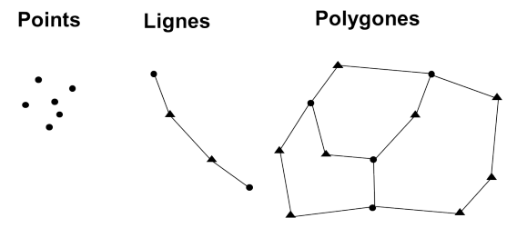
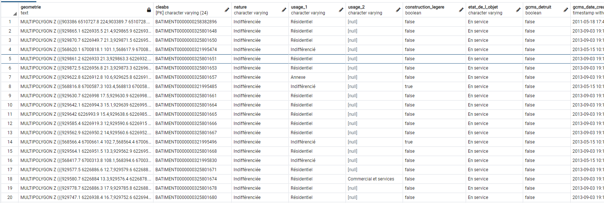
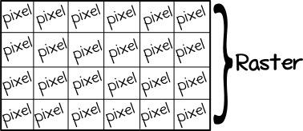
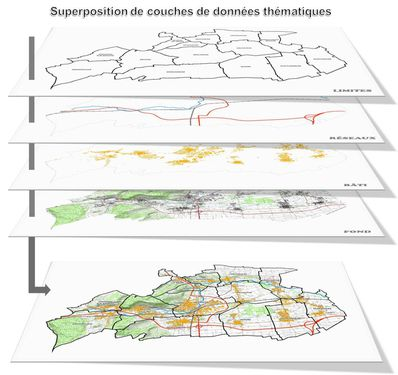
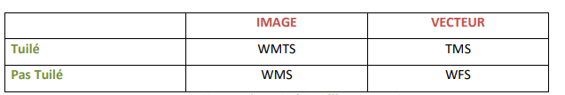
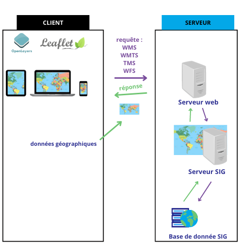
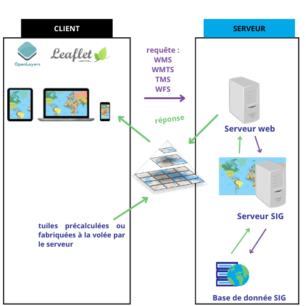

ORVT

# **Introduction**

## **1 - Système d'information géographique**
Un système d'information géographique est un système d'information, composé de matériels, d'outils informatiques, de logiciels et de personnel qualifié, spécialement conçu pour recueillir, stocker, analyser, traiter, gérer et diffuser les données géographiques. On appelle donnée géographique une donnée contenant une référence à un lieu ou une position des entités à la surfaces de la terre. Elles sont utilisées dans plusieurs domaines notamment de la cadre de la recherche scientifique, dans le domaine des transport, de l'agriculture etc...

### **1.1 Acquisition des données géographiques**
Les données géographiques sont obtenues de plusieurs façons. Les deux manières les plus utilisées sont l'imagerie aérienne et l'imagerie satellitaire.
- **Imagerie aérienne** : Une photographie aérienne désigne une photographie prise depuis les airs. L'IGN avec sa flotte aérienne (4 avions), photographie l'ensemble du territoire avec des caméras numériques tous les 3 ans. Les avions se placent à une certaine altitude et s'y tiennent en prennant des images numériques verticales couvrant 1.5 km de longeur par 1.5 km de largeur au sol. Ces opérations se font itératicement afin de couvrir l'ensemble du térritoire national.
- **Imagerie satellitaire** : Une image satellite désigne une prise de vue transmise par un satellite en orbite. Grâce à un personnel compétent en géométrie et en photogrammétrie, l'IGN a réussi à développer des chaînes de production oppérationnel de cartographie à parties d'images satellites.

## **2 - Données géographiques : vecteur et raster**
Il existe deux manières de représenter les données géographiques de manière numérique à savoir: le mode vecteur et le mode raster.

### 2.1 Mode vecteur
#### 2.1.1 Généralités
Les données géographiques en mode vecteur permettent de modéliser le monde réel à travers des objets. Un objet est caractérisé par deux éléments : les informations qui lui sont associées ou données attributaires et sa forme ou sa géométrie. La géométrie est constituée d’un ou plusieurs points interconnectés. Un point est une position dans l’espace. Il existe trois principaux types de géométrie : point, ligne et polygone. Si un objet dispose d’un seul point, alors sa forme est un point. Si un objet dispose de plusieurs points qui ne forment pas de forme géométrique fermée, alors sa forme est une ligne. Si un objet dispose de plusieurs points interconnectés formant une forme géométrique close, alors sa forme est un polygone.

Les objets peuvent être par exemple des maisons, des routes ou arbres. Ils sont stockés 
dans des bases de données avec leurs coordonnées spatiales et leurs données attributaires ou métadonnées. 

### 2.2 Mode raster
#### 2.2.1 Généralités
Les données géographiques en mode raster sont des images /*(plans scannés, photographie aériennes, images satellitaires, modèles numériques de terrain)*/ constitués de plusieurs pixels organisés sous forme de grilles en lignes et colonnes. Un pixel est l'unité de base de la définition d'une image numérique matricielle. A chaque pixel est associé une ou plusieurs valeurs numériques décrivant les caractéristiques de l'espace telles que la température, l'altitude ou la végétation. 

### 1.3 Le principe de couches
Si l’on souhaite représenter différents types d’objets on utilise le principe de superposition 
de couches qui consiste à disposer différentes couches d’objets les unes sur les autres afin de constituer une carte. Chaque couche regroupes les données appartenant à une même thématique ou classe d'objets (immeubles, routes etc...)

## **3 - Web Mapping**
Une carte géographique est une représentation graphique d'un espace géographique. Avec l'évolution des technologies et d'internet, le besoin d'affichage de carte géographique sur tous types d'écrans devient de plus en plus demandé par les utilisateurs et cela est possible grâce au Web mapping. Le web mapping ou cartographie web est la forme de cartographie qui fait usage d’internet afin de concevoir, traiter, produire et publier des cartes géographiques. Ces communications sont possibles grâce à un ensemble de règles appelées protocole. L’Open Géospatial Consortium (OGC) est une organisation internationale qui implémente des standards pour les services et le contenu géospatial, le traitement de données géographiques et les formats d’échange.
Parmi les spécifications, les plus couramment utilisés à l'IGN sont :

- **Web Feature Service (WFS)** : Permet au moyen d’une URL formatée, d’interroger des 
serveurs cartographiques afin de manipuler des objets géographiques vectoriels. Les opérations de manipulations permettent de : créer de nouveaux objets, effacer, récupérer, rechercher ou mettre à jour des objets. Le protocole WFS permet d'effectuer 5 principales requêtes afin d'obtenir des informations :
    - GetCapabilities : permet de connaître les capacités du serveur (quelles opérations sont supportées et quels objets sont fournis).
    - DescribeFeatureType : permet de retourner la structure de chaque entité susceptible d’être fournie par le serveur.
    - GetFeature : permet de livrer des objets (géométrie et/ou attributs) en GML (Geography Markup Language).
    - LockFeature : permet de bloquer des objets lors d'une transaction.
    - Transaction : permet de modifier l'objet (création, mise à jour, effacer).

    On retrouve plusieurs paramètres selon les requêtes :
    - paramètres communs :
        - VERSION : la version du service utilisée (1.0.0, 2.0.0, …)
        - REQUEST : la requête adressée au serveur (GetCapabilities, GetFeature ou DescribreFeatureType)
        - SERVICE : le type de service (ici "WFS")
    - paramètres requête DescribeFeatureType :
        - TYPENAME : le nom du type d’élément (classe d’objet) dont on veut connaitre la structure
    - paramètres requête GetFeature :
        - TYPENAME : le nom du type d’élément (classe d’objet) dont on veut récupérer des éléments (objets)
        - OUTPUTFORMAT : le format de réponse à la requête
        - COUNT : le nombre maximum d’éléments retournés (MAXFEATURES si version 1.0.0, COUNT si version 2.0.0)
        - FILTER : le filtre personnalisé qui va permettre d’effectuer des sélection sur les éléments à récupérer.

    La structure d'une URL WFS est la suivante : http://host/path?name=value& où name=value& correspond à une liste de paramètres

-  **Web Map Service (WMS)** : Permet de mettre à disposition d’utilisateurs distants des images géoréférencées, via une simple requête HTTP, à partir de données sources raster (image) ou vecteur. Le protocole WMS permet d'effectuer 3 principales requêtes :
    - GetCapabilities : retourne les méta-données qui décrivent le contenu du service et les paramètres acceptés
    - GetMap : renvoie une image de la carte ;
    - GetFeatureInfo : renvoie des informations sur les objets ayant servi à générer la carte (optionnelle).

    On retrouve plusieurs paramètres selon les requêtes :
    - paramètres communs :
        - VERSION : la version du service utilisée (1.0.0, 2.0.0, …)
        - REQUEST : la requête adressée au serveur (GetCapabilities, GetFeature ou DescribreFeatureType)
        - SERVICE : le type de service (ici "WMS")
    - paramètres requête GetFeature :
        - FORMAT : le format de sortie - type-mime - du fichier image (“image/png”, “image/jpg”, …) 
        - LAYERS : la ou les ressources à utiliser pour calculer l’image. C’est le nom technique de la ressource qui est utilisé ;
        - STYLES : le style de rendu des couches ;
        - WIDTH : largeur de l’image finale en pixels ;
        - HEIGHT : hauteur de l’image finale en pixels ;
        - En WMS 1.0 WMS 1.1 et WMS 1.2, le paramètre SRS (Spatial Reference Système) et en WMS 1.3 le paramètre est renommé CRS. Ce paramètre indique le système de coordonnées utilisé ;
        - BBOX (Bounding Box) : l’emprise géographique des données à rendre dans l’image.
        - DPI : densité de l’image attendue en “dot per inch” ou “pixel par pouce” (par défaut : 90,7 DPI).
        - OUTPUTFORMAT correspond au format de sortie de l'image (exemple : image/png).

        La structure d'une URL WMS est la suivante : http://host/path?{name=value&} où name=value& correspond à une liste de paramètres

- **Web Map Tile Service (WMTS)** : Permet d'obtenir des cartes géo-référencées tuilées à partir d'un serveur. Ce service est comparable au Web Map Service (WMS) mais tandis que le WMS permet de faire des requêtes nécessitant une certaine puissance de calcul côté serveur à chaque requête, le WMTS met l'accent sur la performance et ne permet de requêter que des images pré-calculées (tuiles) par le serveur. Le protocole WMTS permet d'effectuer 3 principales requêtes :
    - GetCapabilities : retourne les méta-données qui décrivent le contenu du service et les paramètres acceptés
    - GetTile : renvoie une image précalculée de la pyramide
    - GetFeatureInfo : renvoie des informations additionnelles sur un endroit d’une image retournée (optionnelle)

     On retrouve plusieurs paramètres selon les requêtes :
    - paramètres communs :
        - VERSION : la version du service utilisée
        - REQUEST : la requête adressée au serveur
        - SERVICE : le type de service (ici "WMTS")
    - paramètres requête GetFeature :
        - FORMAT : le format de sortie du fichier image 
        - LAYERS : le nom de la couche concernée
        - TILEMATRIXSET : Le nom de la pyramide d’images
        - TILEMATRIX : Le nom de la matrice qui contient la tuile
        - TILEROW : Le numéro de ligne du coin supérieur gauche de la tuile
        - TILECOL : Le numéro de colonne du coin supérieur gauche de la tuile

    La structure d'une URL WMTS est la suivante : http://host/path?{name=value&} où name=value& correspond à une liste de paramètres. 

- **Tile Map Service (TMS)** : Le service TMS est comme le service WFS. Il Transmet des données géographiques vectorielles mais sous formes de tuiles vecteurs. Le protocole TMS permet d'effectuer 2 principales opérations :
    - Accès aux capacités du service : renvoie les ressources disponibles, les styles prédéfinis
    - Accès à une tuile : renvoie une tuile vectorielle pré-calculée

### 1.3 Tuiles
Les tuiles (rasters ou vecteurs) sont des paquets de données géographiques prédécoupées en forme de dalles par le serveur, prêtes à être transférées lorsqu’une requête est émise. Ces tuiles sont produites par le serveur en fonction de l’échelle de visualisation. On appelle cela le principe de la pyramide. À chaque niveau de zoom, des tuiles spécifiques sont fournis. Les tuiles présentent plusieurs avantages d'utilisation dont :
- La rapidité d'acès à la donnée lors d'une requête car les tuiles sont prédécoupées à l'avance par le serveur et stocker dans le cache
- La possibilité de personnalisation du style côté client (pour les tuiles vectorielles)

### 1.3 Architecture de la cartographie web
La cartographie web se base sur une architecture client/serveur:
- Client : Ici généralement représenté par un navigateur web, permet de visualiser les données géographiques transmises depuis le serveur
- Serveur : Traite les données géographiques et les transmet

Selon l'utilisation du service tuilage ou non, le processus de production de données géographiques du côté serveur se fait différemment

- Architecture sans utilisation du service de tuilage : La communication s’effectue de la
manière suivante (voir figure 7) :
    - Le client envoie une requête pour l’affichage d’une carte web géographique
    - Le serveur reçoit la requête
    - Le serveur extrait les données nécessaires à la constitution de la carte web géographique à partir de la base de données
    - Le serveur transmets les données géographiques
    - La carte géographique web est constituée à partir des données géographiques reçues du serveur

- Architecture avec utilisation du service de tuilage : La communication s’effectue de la
manière suivante (voir figure 7) :
    - Le client envoie une requête pour l’affichage d’une carte web géographique
    - Le serveur reçoit la requête
    - Le serveur extrait les données nécessaires à la constitution de la carte web 
    géographique à partir de la base de données
    - Le serveur sélectionne les tuiles si elles avaient déjà été chargée ou sinon les 
    fabrique à la volée par rapport à l’échelle de visualisation et la zone concernée et les 
    transmet au client
    - Le serveur transmets les données géographiques permettant de fabriquer la carte web côté client
    - La carte géographique web est constituée à partir des tuiles vecteurs reçues du 
    serveur

